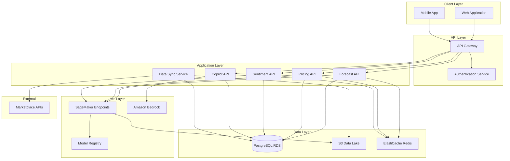
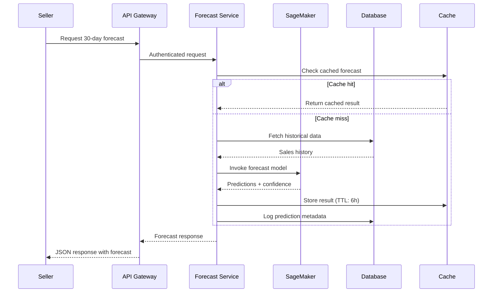

# Design Document: SellerSense AI

## Overview

SellerSense AI is a cloud-native decision intelligence platform built on AWS infrastructure that provides Indian sellers with AI-powered business insights. The system architecture follows a microservices pattern with four core analytical engines: Demand Forecasting, Pricing Intelligence, Review Sentiment Analysis, and an AI Business Copilot. Each engine operates independently while sharing a common data layer and API gateway.

The platform leverages AWS managed services to minimize operational overhead:
- **Amazon SageMaker** for ML model training, hosting, and inference
- **Amazon Bedrock** for generative AI capabilities in the copilot
- **AWS Lambda** for serverless compute and API endpoints
- **Amazon RDS (PostgreSQL)** for structured data storage
- **Amazon S3** for data lake and model artifacts
- **Amazon API Gateway** for RESTful API management
- **Amazon CloudWatch** for monitoring and observability
- **AWS Secrets Manager** for credential management

The system is designed for horizontal scalability, supporting thousands of concurrent sellers while maintaining sub-10-second response times for analytical queries.

## Architecture

### High-Level Architecture



### Component Interaction Flow



## Components and Interfaces

### 1. Data Sync Service

**Responsibility**: Orchestrate data ingestion from marketplace APIs and maintain data freshness.

**Key Operations**:
- `sync_marketplace_data(seller_id, marketplace_type)`: Fetch and store sales, products, reviews
- `validate_data_quality(raw_data)`: Check for completeness, anomalies, and schema compliance
- `schedule_sync_jobs()`: Manage daily sync schedules for all active sellers
- `handle_sync_failure(seller_id, error)`: Implement retry logic and error notifications

**Data Flow**:
1. Authenticate with marketplace API using stored OAuth tokens
2. Fetch incremental data since last sync timestamp
3. Validate data schema and quality
4. Transform to internal schema
5. Store in PostgreSQL (transactional data) and S3 (raw data archive)
6. Update sync metadata and timestamps

**Error Handling**:
- Retry failed API calls up to 3 times with exponential backoff
- Log all sync failures with detailed error context
- Send notification to seller after 3 consecutive failures
- Maintain sync status dashboard for monitoring

### 2. Demand Forecasting Engine

**Responsibility**: Generate accurate demand predictions using ensemble ML models.

**Model Architecture**:
- **Prophet**: Captures seasonality and trend components
- **XGBoost**: Handles non-linear relationships and feature interactions
- **LSTM**: Captures sequential dependencies in time series
- **Ensemble**: Weighted average based on validation performance

**Key Operations**:
- `generate_forecast(seller_id, product_id, horizon)`: Return predictions for 30/60/90 days
- `calculate_confidence_intervals(predictions, model_uncertainty)`: Compute statistical bounds
- `evaluate_forecast_accuracy(predictions, actuals)`: Calculate MAE, RMSE, MAPE
- `retrain_models(seller_id)`: Trigger monthly model updates

**Input Features**:
- Historical daily sales (minimum 90 days, optimal 365+ days)
- Day of week, month, year
- Holiday indicators (Indian festivals, national holidays)
- Promotional event flags
- Regional demand patterns
- Product category trends
- Price history

**Output Format**:
```json
{
  "product_id": "SKU123",
  "forecast_date": "2024-01-15",
  "horizon": 30,
  "predictions": [
    {"date": "2024-01-16", "quantity": 45, "lower_bound": 38, "upper_bound": 52},
    {"date": "2024-01-17", "quantity": 48, "lower_bound": 41, "upper_bound": 55}
  ],
  "accuracy_metrics": {
    "mape": 12.5,
    "mae": 5.2,
    "rmse": 7.8
  },
  "model_version": "v2.3.1"
}
```

**Caching Strategy**:
- Cache forecasts for 6 hours (forecasts don't change frequently)
- Invalidate cache when new sales data is synced
- Use Redis with product_id + horizon as cache key

### 3. Pricing Intelligence Engine

**Responsibility**: Provide optimal pricing recommendations based on competitive analysis and demand elasticity.

**Key Operations**:
- `analyze_competitor_prices(product_id)`: Scrape and analyze competitor pricing
- `calculate_demand_elasticity(product_id)`: Estimate price sensitivity from historical data
- `optimize_price(product_id, objective)`: Find optimal price for revenue or margin maximization
- `simulate_pricing_scenarios(product_id, price_range)`: Model revenue outcomes

**Demand Elasticity Model**:
- Use regression to estimate: `log(quantity) = β₀ + β₁ * log(price) + β₂ * controls + ε`
- Elasticity coefficient: `β₁` indicates % change in demand per % change in price
- Control variables: seasonality, promotions, competitor prices

**Optimization Algorithm**:
1. Define objective function: `Revenue = Price × Predicted_Demand(Price)`
2. Use gradient-based optimization to find price that maximizes objective
3. Apply business constraints (minimum margin, competitive positioning)
4. Return optimal price with expected revenue and margin

**Output Format**:
```json
{
  "product_id": "SKU123",
  "current_price": 499,
  "optimal_price": 549,
  "price_range": {"min": 520, "max": 580},
  "expected_impact": {
    "revenue_change_percent": 12.5,
    "margin_change_percent": 8.3,
    "volume_change_percent": -5.2
  },
  "competitor_analysis": {
    "avg_competitor_price": 565,
    "min_competitor_price": 499,
    "max_competitor_price": 649
  },
  "demand_elasticity": -1.2
}
```

### 4. Review Sentiment Analyzer

**Responsibility**: Extract actionable insights from customer reviews using NLP.

**Model Pipeline**:
1. **Language Detection**: Identify Hindi vs English text
2. **Translation**: Convert Hindi to English for unified processing
3. **Sentiment Classification**: Fine-tuned BERT model (positive/negative/neutral)
4. **Aspect Extraction**: Identify product aspects mentioned (quality, delivery, packaging)
5. **Complaint Clustering**: Group similar complaints using embeddings + K-means

**Key Operations**:
- `classify_sentiment(review_text)`: Return sentiment label and confidence score
- `extract_aspects(review_text)`: Identify mentioned product aspects
- `cluster_complaints(reviews)`: Group similar negative reviews
- `generate_insights(sentiment_data)`: Create actionable recommendations

**Sentiment Scoring**:
- Product-level score: Weighted average of review sentiments (recent reviews weighted higher)
- Aspect-level scores: Separate scores for quality, delivery, packaging, etc.
- Trend detection: Compare current 30-day score vs previous 30-day score

**Output Format**:
```json
{
  "product_id": "SKU123",
  "overall_sentiment": {
    "score": 0.72,
    "distribution": {"positive": 65, "neutral": 25, "negative": 10}
  },
  "aspect_sentiments": {
    "quality": 0.78,
    "delivery": 0.65,
    "packaging": 0.82
  },
  "top_complaints": [
    {"theme": "delayed_delivery", "count": 15, "sample_reviews": ["..."]},
    {"theme": "product_damage", "count": 8, "sample_reviews": ["..."]}
  ],
  "recommendations": [
    "Improve packaging to reduce damage complaints",
    "Coordinate with logistics partner to reduce delivery delays"
  ],
  "trend": "declining"
}
```

### 5. AI Business Copilot

**Responsibility**: Provide conversational AI interface for business queries using Amazon Bedrock.

**Architecture**:
- **LLM**: Claude 3 via Amazon Bedrock
- **Context Retrieval**: Fetch relevant data from database based on query intent
- **Prompt Engineering**: Structure prompts with seller context and data
- **Response Generation**: Generate natural language responses with citations

**Query Processing Flow**:
1. **Intent Classification**: Determine query type (forecast, pricing, sentiment, general)
2. **Entity Extraction**: Extract product IDs, date ranges, metrics from query
3. **Data Retrieval**: Fetch relevant data from appropriate services
4. **Context Assembly**: Build prompt with query + seller data + instructions
5. **LLM Invocation**: Call Bedrock API with assembled prompt
6. **Response Formatting**: Structure response with data visualizations if needed

**Key Operations**:
- `process_query(seller_id, query_text, language)`: Main entry point
- `classify_intent(query_text)`: Determine query category
- `retrieve_context(seller_id, intent, entities)`: Fetch relevant data
- `generate_response(query, context)`: Call Bedrock and format response

**Example Prompt Template**:
```
You are a business intelligence assistant for an Indian e-commerce seller.

Seller Context:
- Business: {seller_name}
- Products: {product_count} active SKUs
- Current month sales: ₹{revenue}

Query: {user_query}

Relevant Data:
{context_data}

Provide a clear, actionable response in {language}. Include specific numbers and recommendations.
```

**Supported Query Types**:
- Sales trend analysis: "Why are my sales dropping?"
- Product recommendations: "Which product should I promote?"
- Pricing questions: "What price should I test for Diwali?"
- Inventory guidance: "How much stock do I need for next month?"
- Sentiment insights: "What are customers complaining about?"

### 6. Authentication Service

**Responsibility**: Manage user authentication, authorization, and session management.

**Key Operations**:
- `register_seller(email, password)`: Create new account with email verification
- `authenticate(email, password)`: Validate credentials and create session
- `verify_session(session_token)`: Validate active session
- `enforce_rbac(user_id, resource, action)`: Check role-based permissions
- `enable_mfa(user_id)`: Configure multi-factor authentication

**Security Measures**:
- Password hashing: bcrypt with salt
- Session tokens: JWT with 30-minute expiration
- Rate limiting: 5 failed login attempts trigger 15-minute lockout
- MFA: TOTP-based (optional)
- API key management: For programmatic access

## Data Models

### Seller
```python
{
  "seller_id": "uuid",
  "email": "string",
  "password_hash": "string",
  "business_name": "string",
  "marketplace_connections": [
    {
      "marketplace": "amazon_in",
      "seller_account_id": "string",
      "oauth_token": "encrypted_string",
      "last_sync": "timestamp"
    }
  ],
  "subscription_tier": "free|pro|enterprise",
  "created_at": "timestamp",
  "mfa_enabled": "boolean"
}
```

### Product
```python
{
  "product_id": "uuid",
  "seller_id": "uuid",
  "sku": "string",
  "name": "string",
  "category": "string",
  "current_price": "decimal",
  "marketplace": "string",
  "marketplace_product_id": "string",
  "created_at": "timestamp",
  "updated_at": "timestamp"
}
```

### Sales_Record
```python
{
  "record_id": "uuid",
  "product_id": "uuid",
  "seller_id": "uuid",
  "date": "date",
  "quantity_sold": "integer",
  "revenue": "decimal",
  "marketplace": "string",
  "region": "string",
  "promotion_active": "boolean",
  "synced_at": "timestamp"
}
```

### Review
```python
{
  "review_id": "uuid",
  "product_id": "uuid",
  "seller_id": "uuid",
  "marketplace_review_id": "string",
  "rating": "integer (1-5)",
  "review_text": "string",
  "language": "string",
  "review_date": "timestamp",
  "sentiment": "positive|neutral|negative",
  "sentiment_score": "float (0-1)",
  "aspects": ["string"],
  "processed_at": "timestamp"
}
```

### Forecast
```python
{
  "forecast_id": "uuid",
  "product_id": "uuid",
  "seller_id": "uuid",
  "forecast_date": "date",
  "horizon_days": "integer",
  "predictions": [
    {
      "date": "date",
      "quantity": "integer",
      "lower_bound": "integer",
      "upper_bound": "integer"
    }
  ],
  "model_version": "string",
  "accuracy_metrics": {
    "mape": "float",
    "mae": "float",
    "rmse": "float"
  },
  "created_at": "timestamp"
}
```

### Pricing_Recommendation
```python
{
  "recommendation_id": "uuid",
  "product_id": "uuid",
  "seller_id": "uuid",
  "current_price": "decimal",
  "optimal_price": "decimal",
  "price_range": {"min": "decimal", "max": "decimal"},
  "expected_impact": {
    "revenue_change_percent": "float",
    "margin_change_percent": "float",
    "volume_change_percent": "float"
  },
  "demand_elasticity": "float",
  "competitor_prices": ["decimal"],
  "created_at": "timestamp"
}
```

### Model_Metadata
```python
{
  "model_id": "uuid",
  "model_type": "forecast|pricing|sentiment",
  "version": "string",
  "seller_id": "uuid (null for global models)",
  "training_date": "timestamp",
  "validation_metrics": "json",
  "s3_artifact_path": "string",
  "sagemaker_endpoint": "string",
  "status": "training|deployed|deprecated",
  "created_at": "timestamp"
}
```

## Correctness Properties

*A property is a characteristic or behavior that should hold true across all valid executions of a system—essentially, a formal statement about what the system should do. Properties serve as the bridge between human-readable specifications and machine-verifiable correctness guarantees.*


### Property 1: Complete Forecast Structure

*For any* forecast request with valid seller and product data, the Forecasting_Engine should return predictions for all three time horizons (30, 60, 90 days) where each prediction includes the predicted quantity, lower confidence bound, and upper confidence bound.

**Validates: Requirements 1.1, 1.3**

### Property 2: Forecast Incorporates Multiple Factors

*For any* product with historical data containing seasonality patterns, promotional events, or regional variations, forecasts generated with these factors should differ from forecasts generated without them, demonstrating that the engine incorporates these inputs.

**Validates: Requirements 1.2**

### Property 3: Forecast Accuracy Metrics Completeness

*For any* forecast evaluation with predictions and actual values, the accuracy calculation should return all three metrics (MAE, RMSE, MAPE) with valid numerical values.

**Validates: Requirements 1.4**

### Property 4: Independent Product Forecasts

*For any* seller with multiple products, generating forecasts for all products should produce distinct predictions for each SKU, where modifying one product's data does not affect forecasts for other products.

**Validates: Requirements 1.6**

### Property 5: Pricing Analysis Includes Competitor Data

*For any* pricing recommendation request, the Pricing_Engine should include competitor price analysis in the output, with at least the average, minimum, and maximum competitor prices.

**Validates: Requirements 2.1**

### Property 6: Demand Elasticity Influences Pricing

*For any* two products with different demand elasticity coefficients (one high, one low), the pricing recommendations should reflect different optimization strategies, with high-elasticity products optimizing for revenue and low-elasticity products optimizing for margin.

**Validates: Requirements 2.2, 2.6**

### Property 7: Complete Pricing Recommendation Structure

*For any* pricing recommendation, the output should include optimal price, price range (min/max), expected revenue impact, expected margin impact, expected volume impact, and demand elasticity coefficient.

**Validates: Requirements 2.3**

### Property 8: Pricing Scenario Simulation

*For any* set of price points provided for scenario analysis, the Pricing_Engine should return revenue projections for each price point, with the number of projections matching the number of input prices.

**Validates: Requirements 2.4**

### Property 9: Review Sentiment Classification

*For any* product review text, the Sentiment_Analyzer should classify it as exactly one of: positive, negative, or neutral, with a confidence score between 0 and 1.

**Validates: Requirements 3.1**

### Property 10: Complaint Clustering Consistency

*For any* set of reviews with similar complaint themes, the clustering algorithm should group them together, while reviews with different themes should be in separate clusters.

**Validates: Requirements 3.2**

### Property 11: Complete Sentiment Analysis Structure

*For any* sentiment analysis result, the output should include overall sentiment score, sentiment distribution (positive/neutral/negative counts), aspect-level sentiments, top complaint categories, and actionable recommendations when negative sentiment is present.

**Validates: Requirements 3.3, 3.4**

### Property 12: Multi-Language Review Processing

*For any* review written in Hindi or English, the Sentiment_Analyzer should successfully process and classify the sentiment, returning a valid sentiment label and score.

**Validates: Requirements 3.5**

### Property 13: Copilot Response Completeness

*For any* valid natural language query from a seller, the AI_Copilot should generate a non-empty response within the expected format.

**Validates: Requirements 4.1**

### Property 14: Copilot Data Grounding

*For any* copilot response to queries about seller-specific metrics (sales, products, reviews), the response should reference actual data points from that seller's account, not generic information.

**Validates: Requirements 4.2**

### Property 15: Trend Queries Include Supporting Data

*For any* query about sales trends or patterns, the copilot response should include specific numerical data points or time-series values that support the explanation.

**Validates: Requirements 4.3**

### Property 16: Recommendation Queries Reference Multiple Engines

*For any* query requesting business recommendations, the copilot response should reference insights from at least two of the analytical engines (forecasting, pricing, or sentiment).

**Validates: Requirements 4.4**

### Property 17: Ambiguous Query Handling

*For any* query that lacks essential context (missing product ID, unclear time range, vague metric), the copilot should respond with clarifying questions rather than making assumptions.

**Validates: Requirements 4.5**

### Property 18: Language Consistency in Copilot

*For any* query submitted in a specific language (Hindi or English), the copilot response should be in the same language as the query.

**Validates: Requirements 4.6**

### Property 19: Data Quality Validation

*For any* marketplace data sync operation, records with missing required fields, invalid data types, or values outside acceptable ranges should be flagged as anomalies and not processed into the main database.

**Validates: Requirements 5.3**

### Property 20: Data Encryption at Rest

*For any* sensitive data stored in the database (OAuth tokens, seller credentials, financial data), the stored value should be encrypted, not plaintext.

**Validates: Requirements 5.5**

### Property 21: Automatic Model Retraining Trigger

*For any* model whose validation performance metrics fall below defined thresholds (e.g., MAPE > 20%), the system should automatically initiate a retraining job.

**Validates: Requirements 6.2**

### Property 22: Model Validation Before Deployment

*For any* model deployment operation, the system should validate performance on holdout data and only proceed with deployment if validation metrics meet minimum thresholds.

**Validates: Requirements 6.3**

### Property 23: Best Model Selection

*For any* set of trained model candidates with different validation metrics, the system should select and deploy the model with the best performance score.

**Validates: Requirements 6.4**

### Property 24: Model Versioning and Rollback

*For any* model deployment, the system should create a new version entry in the model registry and maintain the previous version with rollback capability.

**Validates: Requirements 6.5**

### Property 25: Prediction Error Logging

*For any* model prediction that deviates from the actual value by more than a threshold percentage, the system should log the discrepancy with prediction metadata for analysis.

**Validates: Requirements 6.6**

### Property 26: Password Strength Enforcement

*For any* registration attempt, passwords that don't meet strength requirements (minimum length, character diversity) should be rejected, and email verification should be required before account activation.

**Validates: Requirements 7.1**

### Property 27: Authentication and Session Creation

*For any* login attempt with valid credentials, the system should create a session token, while invalid credentials should not create a session.

**Validates: Requirements 7.2**

### Property 28: Role-Based Access Control

*For any* request to access a protected resource, users without the required role should receive an authorization error, while users with the proper role should be granted access.

**Validates: Requirements 7.3**

### Property 29: MFA Enforcement

*For any* user account with MFA enabled, login attempts should require both password and second-factor verification, while accounts without MFA should only require password.

**Validates: Requirements 7.6**

### Property 30: Batch Processing for Large Operations

*For any* data processing operation exceeding a size threshold (e.g., >10,000 records), the system should queue the operation for batch processing rather than executing it synchronously.

**Validates: Requirements 8.5**

### Property 31: Comprehensive Metrics Collection

*For any* API request or model inference operation, the system should emit metrics including latency, status code, and any errors encountered.

**Validates: Requirements 9.1**

### Property 32: Detailed Error Logging

*For any* error or exception, the system should log an entry containing the error message, stack trace, request context, and timestamp.

**Validates: Requirements 9.2, 9.5**

### Property 33: Rate Limit Alerting

*For any* API or service approaching its rate limit (e.g., >80% of limit), the system should trigger an alert to operators before the limit is exceeded.

**Validates: Requirements 9.6**

### Property 34: Multi-Format Export Support

*For any* data export request, the system should generate output in both CSV and PDF formats.

**Validates: Requirements 10.1**

### Property 35: Complete Export Data Structure

*For any* export of forecasts or sentiment analysis, the output should include all required fields: for forecasts (predicted values, confidence intervals, accuracy metrics), for sentiment (review text, sentiment scores, complaint categories).

**Validates: Requirements 10.2, 10.3**

### Property 36: Export Authorization Consistency

*For any* export operation, the system should apply the same role-based access controls as the web interface, preventing users from exporting data they cannot view in the UI.

**Validates: Requirements 10.6**

## Error Handling

### Error Categories

**1. Data Sync Errors**
- **Marketplace API failures**: Retry with exponential backoff (3 attempts), then notify seller
- **Authentication errors**: Prompt seller to reconnect marketplace account
- **Data validation errors**: Log invalid records, continue processing valid records
- **Rate limit errors**: Queue requests and retry after rate limit window

**2. Model Inference Errors**
- **Insufficient data**: Return error message indicating minimum data requirements
- **Model endpoint unavailable**: Retry once, then return cached result if available, otherwise error
- **Timeout errors**: Return partial results if available, otherwise error with retry suggestion
- **Invalid input**: Validate inputs before inference, return descriptive error messages

**3. Authentication Errors**
- **Invalid credentials**: Return generic error (don't reveal if email exists)
- **Expired session**: Return 401 status, prompt re-authentication
- **Account locked**: Return error with unlock instructions
- **MFA failure**: Allow 3 attempts, then lock account temporarily

**4. Authorization Errors**
- **Insufficient permissions**: Return 403 status with required role information
- **Resource not found**: Return 404 status
- **Cross-seller access attempt**: Log security event, return 403 status

**5. Business Logic Errors**
- **Forecast horizon too long**: Return error with maximum supported horizon
- **Product not found**: Return 404 with suggestion to sync marketplace data
- **No competitor data available**: Return pricing recommendation with disclaimer
- **Insufficient review data**: Return error indicating minimum review count needed

### Error Response Format

All API errors follow a consistent JSON structure:

```json
{
  "error": {
    "code": "INSUFFICIENT_DATA",
    "message": "Cannot generate forecast: minimum 90 days of sales history required",
    "details": {
      "product_id": "SKU123",
      "available_days": 45,
      "required_days": 90
    },
    "suggestion": "Continue selling for 45 more days to enable forecasting",
    "timestamp": "2024-01-15T10:30:00Z",
    "request_id": "req_abc123"
  }
}
```

### Graceful Degradation

- **Forecast unavailable**: Show historical trends and manual planning tools
- **Pricing engine down**: Show competitor prices without optimization
- **Sentiment analysis delayed**: Show raw reviews with basic filtering
- **Copilot unavailable**: Provide direct links to relevant dashboards

### Monitoring and Alerting

- **Error rate threshold**: Alert if error rate exceeds 5% over 5-minute window
- **Model performance degradation**: Alert if MAPE increases by >10% week-over-week
- **Data sync failures**: Alert after 3 consecutive failures for any seller
- **API latency**: Alert if p95 latency exceeds 15 seconds

## Testing Strategy

### Dual Testing Approach

The testing strategy employs both unit tests and property-based tests to ensure comprehensive coverage:

- **Unit tests**: Validate specific examples, edge cases, error conditions, and integration points
- **Property-based tests**: Verify universal properties across randomized inputs (minimum 100 iterations per test)

Both approaches are complementary and necessary. Unit tests catch concrete bugs in specific scenarios, while property-based tests verify general correctness across a wide input space.

### Property-Based Testing Configuration

**Framework**: Use `hypothesis` for Python components (SageMaker models, Lambda functions)

**Test Configuration**:
- Minimum 100 iterations per property test
- Each test tagged with: `Feature: sellersense-ai, Property {N}: {property_text}`
- Each correctness property from this design document must be implemented as a single property-based test

**Example Property Test Structure**:

```python
from hypothesis import given, strategies as st
import pytest

@given(
    seller_id=st.uuids(),
    product_id=st.uuids(),
    historical_data=st.lists(
        st.tuples(st.dates(), st.integers(min_value=0, max_value=1000)),
        min_size=90
    )
)
@pytest.mark.property_test
@pytest.mark.tag("Feature: sellersense-ai, Property 1: Complete Forecast Structure")
def test_forecast_completeness(seller_id, product_id, historical_data):
    """
    Property 1: For any forecast request with valid data, the engine should
    return predictions for all three horizons with confidence intervals.
    """
    forecast = forecasting_engine.generate_forecast(
        seller_id=seller_id,
        product_id=product_id,
        historical_data=historical_data
    )
    
    # Verify all three horizons present
    assert len(forecast["predictions"]) == 3
    horizons = {p["horizon_days"] for p in forecast["predictions"]}
    assert horizons == {30, 60, 90}
    
    # Verify each prediction has confidence intervals
    for prediction in forecast["predictions"]:
        for daily_pred in prediction["daily_values"]:
            assert "quantity" in daily_pred
            assert "lower_bound" in daily_pred
            assert "upper_bound" in daily_pred
            assert daily_pred["lower_bound"] <= daily_pred["quantity"] <= daily_pred["upper_bound"]
```

### Unit Testing Strategy

**Focus Areas**:
1. **Edge cases**: Empty datasets, single data points, extreme values
2. **Error conditions**: Invalid inputs, missing data, API failures
3. **Integration points**: Database connections, external API calls, model endpoints
4. **Business logic**: Pricing calculations, sentiment scoring, metric computations

**Example Unit Test**:

```python
def test_forecast_with_insufficient_data():
    """Test that forecasting fails gracefully with insufficient historical data."""
    seller_id = uuid.uuid4()
    product_id = uuid.uuid4()
    short_history = [(date.today(), 10)]  # Only 1 day of data
    
    with pytest.raises(InsufficientDataError) as exc_info:
        forecasting_engine.generate_forecast(seller_id, product_id, short_history)
    
    assert "minimum 90 days" in str(exc_info.value).lower()
```

### Integration Testing

**Scenarios**:
1. **End-to-end forecast flow**: Data sync → Model inference → Cache → API response
2. **Copilot with multiple engines**: Query → Intent classification → Data retrieval → LLM → Response
3. **Model retraining pipeline**: Performance monitoring → Trigger → Training → Validation → Deployment
4. **Authentication flow**: Registration → Email verification → Login → Session management

### Test Data Strategy

**Synthetic Data Generation**:
- Use `hypothesis` strategies for property tests
- Create realistic seller profiles with varied product catalogs
- Generate time-series data with seasonal patterns and trends
- Simulate marketplace API responses

**Test Fixtures**:
- Sample seller accounts with known characteristics
- Pre-computed forecasts for validation
- Review datasets with labeled sentiments
- Competitor price datasets

### Performance Testing

**Load Testing**:
- Simulate 1,000 concurrent forecast requests
- Measure p50, p95, p99 latency
- Verify auto-scaling behavior under load

**Stress Testing**:
- Test with maximum data volumes (10+ years of history)
- Test with sellers having 10,000+ products
- Verify graceful degradation under resource constraints

### Continuous Testing

**CI/CD Pipeline**:
1. Run unit tests on every commit
2. Run property tests on every pull request
3. Run integration tests before deployment
4. Run performance tests weekly

**Test Coverage Goals**:
- Unit test coverage: >80% for business logic
- Property test coverage: 100% of correctness properties
- Integration test coverage: All critical user flows
