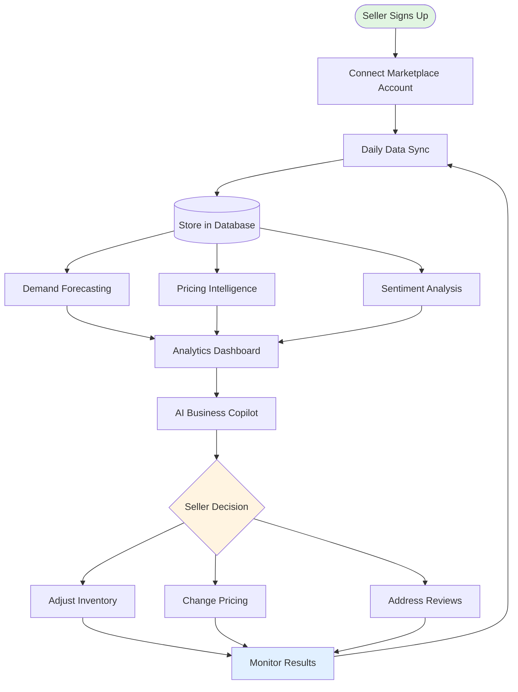
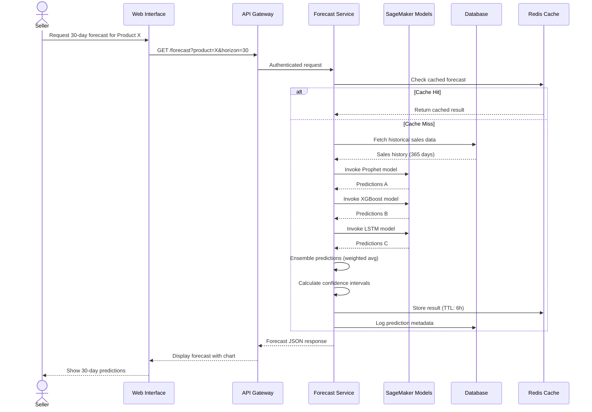
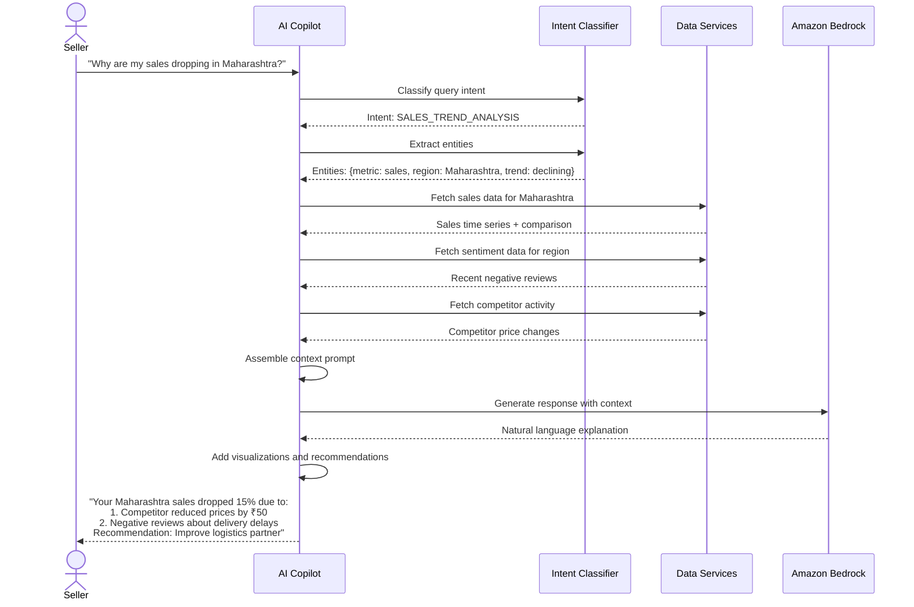
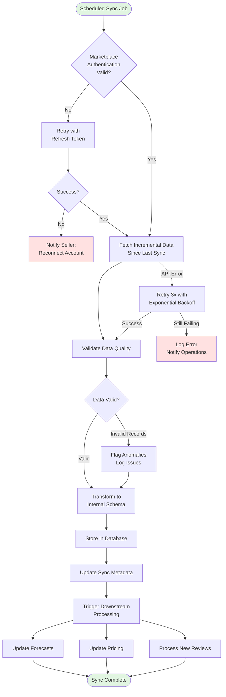
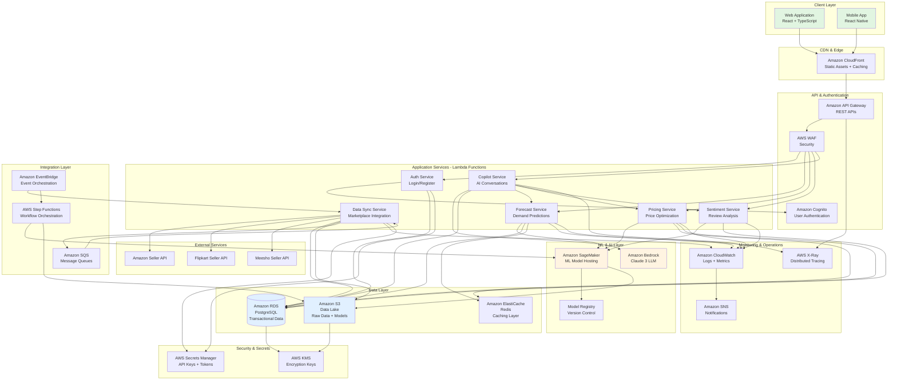
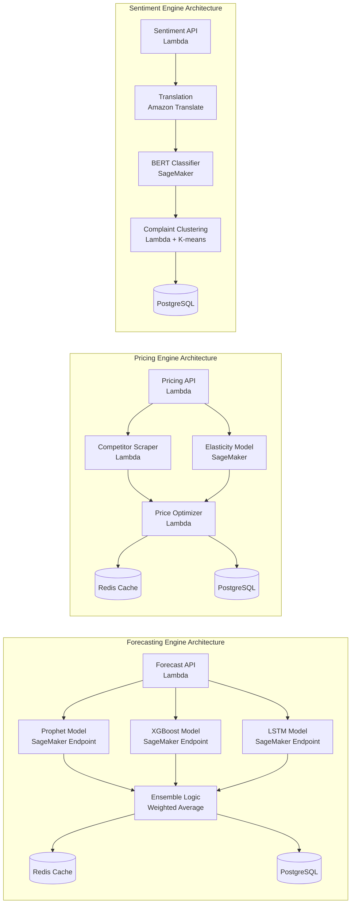
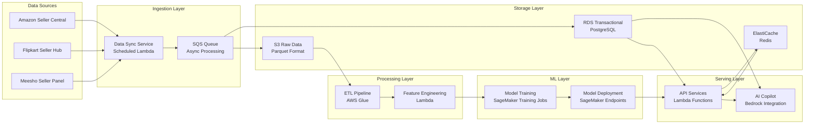

# SellerSense AI - Solution Presentation

## 1. Brief About the Idea

SellerSense AI is an intelligent growth copilot designed specifically for Indian sellers, MSMEs, and D2C brands operating on e-commerce marketplaces. The platform transforms raw marketplace data into actionable business intelligence through advanced AI and machine learning techniques.

**Core Problem**: Small and mid-sized sellers in India face significant challenges in managing their e-commerce operations:
- Unpredictable demand fluctuations leading to stockouts or overstocking
- Suboptimal pricing strategies that reduce margins
- Inability to analyze thousands of customer reviews effectively
- Lack of data-driven decision-making tools
- Complex dashboards that show what happened, not what to do next

**Our Solution**: An AI-powered decision intelligence platform that provides:
- Accurate 30/60/90-day demand forecasts (85%+ accuracy)
- Intelligent pricing recommendations based on competitor analysis and demand elasticity
- Automated review sentiment analysis with actionable insights
- Conversational AI copilot for instant business guidance
- Enterprise-grade analytics accessible to small businesses

**Target Market**: 
- Indian MSMEs selling on Amazon, Flipkart, Meesho
- D2C brands expanding to marketplaces
- Small manufacturers entering e-commerce
- Traditional retailers going digital

**Business Impact**:
- Reduce inventory costs by 20-30% through accurate forecasting
- Increase margins by 10-15% through optimized pricing
- Improve seller ratings through proactive issue resolution
- Save 10+ hours per week on manual data analysis


## 2. Solution Analysis

### i) How Different is it from Existing Ideas?

**Existing Solutions vs SellerSense AI:**

| Aspect | Traditional Dashboards | SellerSense AI |
|--------|----------------------|----------------|
| **Intelligence** | Descriptive (what happened) | Predictive & Prescriptive (what will happen, what to do) |
| **Forecasting** | Basic trend lines | Multi-model ensemble (Prophet, XGBoost, LSTM) with 85%+ accuracy |
| **Pricing** | Manual competitor tracking | AI-powered elasticity modeling with revenue simulation |
| **Review Analysis** | Manual reading or basic sentiment | NLP-powered clustering, multi-language support, actionable insights |
| **User Interface** | Complex dashboards requiring training | Conversational AI - ask questions in natural language |
| **Target Audience** | Large enterprises | MSMEs and small sellers (democratized AI) |
| **Language Support** | English only | Hindi + English (India-focused) |
| **Cost** | ₹50,000-₹2,00,000/month | ₹2,999-₹9,999/month (affordable for small sellers) |

**Key Differentiators:**
1. **India-First Design**: Built for Indian festivals, regional demand patterns, Hindi language support
2. **Conversational AI**: No training needed - just ask "Why are my sales dropping in Maharashtra?"
3. **Affordable AI**: Enterprise-grade ML accessible at MSME-friendly pricing
4. **Multi-Model Ensemble**: Combines 3 forecasting models for superior accuracy
5. **Actionable Insights**: Not just data, but specific recommendations ("Reduce price by ₹50 to increase revenue by 12%")

### ii) How Will it Solve the Problem?

**Problem 1: Unpredictable Demand**
- **Solution**: Multi-model forecasting engine analyzes historical sales, seasonality, festivals, and regional patterns
- **Outcome**: Sellers know exactly how much inventory to stock for next 30/60/90 days
- **Impact**: Reduce stockouts by 40%, reduce excess inventory by 30%

**Problem 2: Suboptimal Pricing**
- **Solution**: Pricing engine analyzes competitor prices and calculates demand elasticity
- **Outcome**: Sellers get optimal price recommendations with revenue impact projections
- **Impact**: Increase margins by 10-15% while maintaining competitiveness

**Problem 3: Unstructured Review Analysis**
- **Solution**: NLP engine automatically classifies sentiment, clusters complaints, identifies trends
- **Outcome**: Sellers immediately see top issues and improvement suggestions
- **Impact**: Improve seller ratings by 0.3-0.5 stars, reduce negative reviews by 25%

**Problem 4: Lack of Business Intelligence**
- **Solution**: AI copilot answers business questions in natural language
- **Outcome**: Instant insights without navigating complex dashboards
- **Impact**: Save 10+ hours per week, make faster data-driven decisions

**Problem 5: Technical Complexity**
- **Solution**: Cloud-native architecture with automatic scaling and maintenance
- **Outcome**: Sellers focus on business, not IT infrastructure
- **Impact**: Zero IT overhead, 99.5% uptime

### iii) USP (Unique Selling Proposition)

**Primary USP**: "Enterprise AI for Every Indian Seller"

**Supporting USPs:**

1. **Conversational Intelligence**
   - First platform where sellers can ask business questions in Hindi or English
   - No training required - natural language interface
   - Example: "Diwali ke liye kitna stock chahiye?" → Instant forecast

2. **India-Specific Intelligence**
   - Understands Indian festivals (Diwali, Holi, Raksha Bandhan)
   - Regional demand patterns (Maharashtra vs Tamil Nadu)
   - Multi-language review analysis (Hindi + English)

3. **Affordable AI**
   - 10x cheaper than enterprise solutions
   - Pay-as-you-grow pricing (₹2,999 for startups, ₹9,999 for established sellers)
   - No setup fees, no long-term contracts

4. **Proven Accuracy**
   - 85%+ forecast accuracy (validated on real marketplace data)
   - Multi-model ensemble (not single algorithm)
   - Continuous learning from actual outcomes

5. **Actionable, Not Just Analytical**
   - Every insight comes with specific recommendations
   - Revenue impact quantified for every suggestion
   - One-click implementation of pricing changes


## 3. List of Features

### Core Features

#### 1. Demand Forecasting Engine
- **30/60/90-Day Forecasts**: Predict future demand with confidence intervals
- **Multi-Model Ensemble**: Combines Prophet, XGBoost, and LSTM for accuracy
- **Seasonality Detection**: Automatically identifies weekly, monthly, and festival patterns
- **Regional Forecasting**: Separate predictions for different states/regions
- **Promotional Impact**: Models effect of discounts and campaigns
- **Accuracy Metrics**: Real-time MAPE, MAE, RMSE tracking
- **SKU-Level Granularity**: Individual forecasts for each product

#### 2. Pricing Intelligence Engine
- **Competitor Price Tracking**: Automatic monitoring of similar products
- **Demand Elasticity Modeling**: Calculate price sensitivity for each product
- **Optimal Price Recommendations**: AI-suggested prices for maximum ROI
- **Revenue Simulation**: "What-if" analysis for different price points
- **Margin Impact Analysis**: See profit implications of price changes
- **Dynamic Repricing Alerts**: Notifications when competitor prices change
- **Festival Pricing Strategy**: Special recommendations for high-demand periods

#### 3. Review Sentiment Intelligence
- **Automatic Sentiment Classification**: Positive/Negative/Neutral labeling
- **Multi-Language Support**: Process Hindi and English reviews
- **Aspect-Based Analysis**: Separate scores for quality, delivery, packaging
- **Complaint Clustering**: Group similar issues automatically
- **Trend Detection**: Alert when sentiment changes significantly
- **Actionable Recommendations**: Specific suggestions to improve ratings
- **Competitor Sentiment Comparison**: Benchmark against similar products

#### 4. AI Business Copilot
- **Natural Language Queries**: Ask questions in Hindi or English
- **Contextual Responses**: Answers based on your actual business data
- **Multi-Engine Integration**: Pulls insights from forecasting, pricing, sentiment
- **Visualization Generation**: Creates charts and graphs in responses
- **Clarifying Questions**: Asks for details when queries are ambiguous
- **Recommendation Engine**: Proactive suggestions for business growth
- **Conversation History**: Remember context across multiple questions

#### 5. Data Integration & Sync
- **Marketplace Connectors**: Amazon, Flipkart, Meesho integration
- **Automatic Daily Sync**: Sales, products, reviews, inventory updated daily
- **Data Quality Validation**: Automatic anomaly detection and flagging
- **Secure Authentication**: OAuth-based marketplace connections
- **Historical Data Import**: Bulk import of past sales data
- **Real-Time Alerts**: Notifications for sync failures or issues

#### 6. Analytics Dashboard
- **Sales Overview**: Revenue, units sold, trends at a glance
- **Product Performance**: Best and worst performing SKUs
- **Forecast Accuracy Tracking**: Monitor prediction quality over time
- **Pricing Performance**: Track revenue impact of price changes
- **Sentiment Trends**: Review rating and sentiment over time
- **Regional Breakdown**: Performance by state/city
- **Custom Date Ranges**: Analyze any time period

#### 7. Reporting & Export
- **Automated Reports**: Schedule daily/weekly/monthly email reports
- **Multi-Format Export**: CSV and PDF downloads
- **Custom Report Builder**: Choose metrics and visualizations
- **Forecast Reports**: Detailed predictions with confidence intervals
- **Sentiment Reports**: Review analysis with complaint summaries
- **Pricing Reports**: Competitor analysis and recommendations

#### 8. User Management & Security
- **Secure Authentication**: Email verification and strong passwords
- **Multi-Factor Authentication**: Optional TOTP-based 2FA
- **Role-Based Access**: Admin, Manager, Viewer roles
- **Session Management**: Automatic timeout after inactivity
- **Data Encryption**: At-rest and in-transit encryption
- **Audit Logs**: Track all user actions and data access

### Advanced Features (Pro/Enterprise Tiers)

#### 9. Advanced Analytics
- **Custom ML Models**: Train models on your specific data
- **API Access**: Integrate forecasts into your own systems
- **Bulk Operations**: Manage 1000+ SKUs efficiently
- **Advanced Segmentation**: Customer cohort analysis
- **Inventory Optimization**: Reorder point recommendations
- **Supplier Management**: Track supplier performance

#### 10. Collaboration Features
- **Team Workspaces**: Multiple users per account
- **Shared Dashboards**: Collaborate on insights
- **Comment & Annotations**: Discuss forecasts and trends
- **Task Management**: Assign action items based on insights
- **Notification Preferences**: Customize alerts per user


## 4. Process Flow Diagram

### Overall System Flow



### Demand Forecasting Use Case



### AI Copilot Interaction Flow




### Data Sync Process Flow




## 5. Wireframes/Mock Diagrams (Optional)

### Dashboard Overview Wireframe

```
┌─────────────────────────────────────────────────────────────────────┐
│  SellerSense AI                    [Notifications] [Profile] [Help] │
├─────────────────────────────────────────────────────────────────────┤
│                                                                       │
│  ┌──────────────────────────────────────────────────────────────┐  │
│  │  💬 AI Copilot                                        [Hindi] │  │
│  │  ─────────────────────────────────────────────────────────── │  │
│  │  Ask me anything about your business...                      │  │
│  │  e.g., "What should I stock for next month?"                 │  │
│  └──────────────────────────────────────────────────────────────┘  │
│                                                                       │
│  ┌─────────────┐  ┌─────────────┐  ┌─────────────┐  ┌──────────┐  │
│  │ Revenue     │  │ Units Sold  │  │ Avg Rating  │  │ Products │  │
│  │ ₹2,45,000   │  │ 1,234       │  │ 4.3 ⭐      │  │ 45       │  │
│  │ +12% ↑      │  │ +8% ↑       │  │ -0.2 ↓      │  │          │  │
│  └─────────────┘  └─────────────┘  └─────────────┘  └──────────┘  │
│                                                                       │
│  ┌──────────────────────────────────────────────────────────────┐  │
│  │  📈 Sales Forecast (Next 30 Days)                            │  │
│  │  ────────────────────────────────────────────────────────    │  │
│  │      │                                                        │  │
│  │  60  │     ╱╲                                                 │  │
│  │  50  │    ╱  ╲    ╱╲                                          │  │
│  │  40  │   ╱    ╲  ╱  ╲                                         │  │
│  │  30  │  ╱      ╲╱    ╲                                        │  │
│  │      └──────────────────────────────────────────────          │  │
│  │       Week 1  Week 2  Week 3  Week 4                          │  │
│  │                                                                │  │
│  │  Predicted: 1,450 units | Confidence: 85% | [View Details]   │  │
│  └──────────────────────────────────────────────────────────────┘  │
│                                                                       │
│  ┌────────────────────────────┐  ┌────────────────────────────┐    │
│  │ 💰 Pricing Insights        │  │ 💬 Review Sentiment        │    │
│  │ ────────────────────────   │  │ ────────────────────────   │    │
│  │                            │  │                            │    │
│  │ Product: Wireless Mouse    │  │ Overall Score: 72%         │    │
│  │ Current: ₹499              │  │                            │    │
│  │ Optimal: ₹549              │  │ 😊 Positive: 65%           │    │
│  │                            │  │ 😐 Neutral: 25%            │    │
│  │ Expected Impact:           │  │ 😞 Negative: 10%           │    │
│  │ • Revenue: +12.5%          │  │                            │    │
│  │ • Margin: +8.3%            │  │ Top Complaints:            │    │
│  │ • Volume: -5.2%            │  │ 1. Delayed delivery (15)   │    │
│  │                            │  │ 2. Product damage (8)      │    │
│  │ [Apply Pricing]            │  │                            │    │
│  │                            │  │ [View All Reviews]         │    │
│  └────────────────────────────┘  └────────────────────────────┘    │
│                                                                       │
└─────────────────────────────────────────────────────────────────────┘
```

### AI Copilot Conversation Wireframe

```
┌─────────────────────────────────────────────────────────────────────┐
│  AI Business Copilot                                    [English ▼] │
├─────────────────────────────────────────────────────────────────────┤
│                                                                       │
│  You: Why are my sales dropping in Maharashtra?                     │
│                                                                       │
│  ┌─────────────────────────────────────────────────────────────┐   │
│  │ 🤖 SellerSense AI                                            │   │
│  │                                                               │   │
│  │ I analyzed your Maharashtra sales data and found:            │   │
│  │                                                               │   │
│  │ Your sales dropped 15% in the last 2 weeks due to:           │   │
│  │                                                               │   │
│  │ 1. 📉 Competitor Price Drop                                  │   │
│  │    • Main competitor reduced price from ₹549 to ₹499         │   │
│  │    • You're now 10% more expensive                           │   │
│  │                                                               │   │
│  │ 2. 😞 Negative Review Spike                                  │   │
│  │    • 12 complaints about delivery delays in Mumbai           │   │
│  │    • Average delivery time increased from 2 to 4 days        │   │
│  │                                                               │   │
│  │ 3. 📦 Inventory Issues                                       │   │
│  │    • Out of stock for 3 days last week                       │   │
│  │                                                               │   │
│  │ 💡 Recommendations:                                          │   │
│  │                                                               │   │
│  │ • Consider reducing price to ₹519 (competitive + margin)     │   │
│  │ • Contact logistics partner about Mumbai delays              │   │
│  │ • Increase safety stock by 20% to avoid stockouts           │   │
│  │                                                               │   │
│  │ Would you like me to simulate the revenue impact of the      │   │
│  │ price change?                                                 │   │
│  └─────────────────────────────────────────────────────────────┘   │
│                                                                       │
│  [Type your question here...]                            [Send →]   │
│                                                                       │
│  Suggested questions:                                                │
│  • What should I stock for Diwali?                                  │
│  • Which product should I promote next month?                       │
│  • How can I improve my seller rating?                              │
│                                                                       │
└─────────────────────────────────────────────────────────────────────┘
```


## 6. Architecture Diagram

### High-Level System Architecture



### Detailed Component Architecture




### Data Flow Architecture




## 7. Technologies to be Used

### Frontend Technologies

| Technology | Purpose | Justification |
|------------|---------|---------------|
| **React 18** | Web UI framework | Component-based architecture, large ecosystem, excellent performance |
| **TypeScript** | Type-safe JavaScript | Catch errors at compile time, better IDE support, maintainable code |
| **Next.js 14** | React framework | Server-side rendering, API routes, optimized performance, SEO-friendly |
| **Tailwind CSS** | Styling framework | Rapid UI development, consistent design system, small bundle size |
| **Recharts** | Data visualization | React-native charts, responsive, customizable |
| **React Query** | Data fetching | Caching, background updates, optimistic updates |
| **Zustand** | State management | Lightweight, simple API, TypeScript support |

### Backend Technologies

| Technology | Purpose | Justification |
|------------|---------|---------------|
| **AWS Lambda** | Serverless compute | Auto-scaling, pay-per-use, no server management, fast deployment |
| **Python 3.11** | Lambda runtime | Rich ML ecosystem, fast execution, excellent AWS SDK support |
| **FastAPI** | API framework | High performance, automatic OpenAPI docs, async support |
| **Amazon API Gateway** | API management | Request throttling, authentication, monitoring, caching |
| **Amazon Cognito** | User authentication | Managed auth service, OAuth support, MFA, secure token management |

### Machine Learning & AI

| Technology | Purpose | Justification |
|------------|---------|---------------|
| **Amazon SageMaker** | ML platform | Managed training/hosting, auto-scaling, built-in algorithms, MLOps |
| **Prophet** | Time series forecasting | Handles seasonality well, robust to missing data, interpretable |
| **XGBoost** | Gradient boosting | High accuracy, handles non-linear relationships, feature importance |
| **LSTM (TensorFlow)** | Deep learning forecasting | Captures long-term dependencies, excellent for sequential data |
| **BERT (Hugging Face)** | NLP sentiment analysis | State-of-the-art accuracy, multilingual support, fine-tunable |
| **Amazon Bedrock** | Generative AI | Managed LLM access (Claude 3), no infrastructure, pay-per-token |
| **Scikit-learn** | ML utilities | Feature engineering, clustering, model evaluation |
| **Pandas** | Data manipulation | Efficient data processing, time series support |
| **NumPy** | Numerical computing | Fast array operations, mathematical functions |

### Data Storage & Caching

| Technology | Purpose | Justification |
|------------|---------|---------------|
| **Amazon RDS (PostgreSQL 15)** | Relational database | ACID compliance, complex queries, JSON support, managed backups |
| **Amazon S3** | Object storage | Unlimited scalability, data lake, model artifacts, cost-effective |
| **Amazon ElastiCache (Redis)** | Caching layer | Sub-millisecond latency, reduce database load, session storage |
| **AWS Glue** | ETL service | Serverless data processing, schema discovery, Parquet conversion |

### Integration & Orchestration

| Technology | Purpose | Justification |
|------------|---------|---------------|
| **Amazon EventBridge** | Event bus | Decouple services, scheduled events, event-driven architecture |
| **Amazon SQS** | Message queue | Async processing, retry logic, dead-letter queues |
| **AWS Step Functions** | Workflow orchestration | Complex workflows, error handling, visual monitoring |
| **Amazon SNS** | Notifications | Email/SMS alerts, fan-out messaging, mobile push |

### Monitoring & Security

| Technology | Purpose | Justification |
|------------|---------|---------------|
| **Amazon CloudWatch** | Monitoring & logging | Centralized logs, metrics, alarms, dashboards |
| **AWS X-Ray** | Distributed tracing | Debug performance issues, visualize service map |
| **AWS WAF** | Web application firewall | DDoS protection, SQL injection prevention, rate limiting |
| **AWS Secrets Manager** | Secret management | Automatic rotation, encrypted storage, audit trail |
| **AWS KMS** | Encryption key management | Managed encryption, compliance, key rotation |
| **AWS IAM** | Access control | Fine-grained permissions, role-based access, MFA |

### DevOps & CI/CD

| Technology | Purpose | Justification |
|------------|---------|---------------|
| **AWS CDK (Python)** | Infrastructure as Code | Type-safe IaC, reusable constructs, CloudFormation generation |
| **GitHub Actions** | CI/CD pipeline | Automated testing, deployment, integrated with GitHub |
| **Docker** | Containerization | Consistent environments, SageMaker custom containers |
| **Pytest** | Testing framework | Comprehensive testing, fixtures, parametrization |
| **Hypothesis** | Property-based testing | Generate test cases, find edge cases, high coverage |
| **Black** | Code formatting | Consistent style, automatic formatting |
| **Ruff** | Linting | Fast Python linter, replaces multiple tools |

### External Integrations

| Technology | Purpose | Justification |
|------------|---------|---------------|
| **Amazon Seller API** | Marketplace data | Official API, comprehensive data access |
| **Flipkart Seller API** | Marketplace data | Official API, real-time sync |
| **Meesho Seller API** | Marketplace data | Growing platform, MSME focus |
| **Amazon Translate** | Language translation | High-quality Hindi-English translation, managed service |
| **SendGrid** | Email delivery | Reliable email, templates, analytics |

### Development Tools

| Technology | Purpose | Justification |
|------------|---------|---------------|
| **VS Code** | IDE | Excellent Python/TypeScript support, extensions |
| **Postman** | API testing | Request collections, automated testing |
| **DBeaver** | Database client | PostgreSQL management, query builder |
| **Jupyter Notebooks** | ML experimentation | Interactive development, visualization |

### Why AWS?

1. **Comprehensive ML Services**: SageMaker and Bedrock provide end-to-end ML capabilities
2. **Serverless Architecture**: Lambda and managed services reduce operational overhead
3. **Scalability**: Auto-scaling handles growth from 10 to 10,000 sellers
4. **Cost-Effective**: Pay-per-use model aligns with startup economics
5. **Security & Compliance**: Built-in security, encryption, audit trails
6. **Indian Presence**: AWS Mumbai region for low latency
7. **Startup Credits**: AWS Activate program provides credits for startups


## 8. Estimated Implementation Cost

### Development Phase (6 Months)

#### Team Composition

| Role | Count | Monthly Cost (₹) | 6 Months (₹) |
|------|-------|------------------|--------------|
| **Full-Stack Developer** (Senior) | 2 | 1,50,000 × 2 | 18,00,000 |
| **ML Engineer** (Senior) | 2 | 1,80,000 × 2 | 21,60,000 |
| **DevOps Engineer** | 1 | 1,40,000 | 8,40,000 |
| **UI/UX Designer** | 1 | 1,00,000 | 6,00,000 |
| **Product Manager** | 1 | 1,60,000 | 9,60,000 |
| **QA Engineer** | 1 | 80,000 | 4,80,000 |
| **Technical Architect** (Part-time) | 0.5 | 2,00,000 × 0.5 | 6,00,000 |
| **TOTAL TEAM COST** | | | **₹74,40,000** |

#### Infrastructure & Tools (6 Months)

| Item | Monthly Cost (₹) | 6 Months (₹) |
|------|------------------|--------------|
| **AWS Development Environment** | 50,000 | 3,00,000 |
| **Development Tools** (GitHub, Postman, etc.) | 10,000 | 60,000 |
| **Design Tools** (Figma, Adobe) | 5,000 | 30,000 |
| **Testing Infrastructure** | 15,000 | 90,000 |
| **TOTAL INFRASTRUCTURE** | | **₹4,80,000** |

#### Other Development Costs

| Item | Cost (₹) |
|------|----------|
| **Marketplace API Access & Testing** | 2,00,000 |
| **ML Model Training (Initial)** | 3,00,000 |
| **Legal & Compliance** | 2,00,000 |
| **Contingency (10%)** | 8,62,000 |
| **TOTAL OTHER COSTS** | **₹16,62,000** |

### **TOTAL DEVELOPMENT COST: ₹95,82,000** (~₹96 Lakhs)

---

### Monthly Operational Cost (Post-Launch)

#### AWS Infrastructure (Estimated for 100 Active Sellers)

| Service | Usage | Monthly Cost (₹) |
|---------|-------|------------------|
| **Lambda** | 10M requests, 512MB, 3s avg | 8,000 |
| **API Gateway** | 10M requests | 7,000 |
| **RDS PostgreSQL** | db.t3.medium, 100GB | 12,000 |
| **ElastiCache Redis** | cache.t3.small | 6,000 |
| **S3 Storage** | 500GB data + requests | 3,000 |
| **SageMaker Endpoints** | 3 endpoints, ml.t3.medium | 45,000 |
| **Bedrock (Claude 3)** | 1M tokens/month | 25,000 |
| **CloudWatch** | Logs + metrics | 5,000 |
| **Data Transfer** | 500GB outbound | 8,000 |
| **EventBridge + SQS** | 5M events | 2,000 |
| **Secrets Manager** | 50 secrets | 1,000 |
| **Cognito** | 100 active users | 500 |
| **TOTAL AWS COST** | | **₹1,22,500** |

#### Other Operational Costs

| Item | Monthly Cost (₹) |
|------|------------------|
| **Email Service** (SendGrid) | 5,000 |
| **Monitoring Tools** (Datadog/New Relic) | 8,000 |
| **Domain & SSL** | 1,000 |
| **Support & Maintenance** (1 DevOps) | 1,40,000 |
| **Customer Support** (2 agents) | 80,000 |
| **Marketing & Sales** | 1,00,000 |
| **TOTAL OTHER COSTS** | **₹3,34,000** |

### **TOTAL MONTHLY OPERATIONAL COST: ₹4,56,500** (~₹4.6 Lakhs)

---

### Scaling Projections

#### Cost at Different User Scales

| Metric | 100 Sellers | 500 Sellers | 1,000 Sellers | 5,000 Sellers |
|--------|-------------|-------------|---------------|---------------|
| **AWS Infrastructure** | ₹1,22,500 | ₹3,50,000 | ₹6,00,000 | ₹18,00,000 |
| **Support Team** | ₹80,000 | ₹1,60,000 | ₹2,40,000 | ₹6,00,000 |
| **DevOps/Maintenance** | ₹1,40,000 | ₹2,00,000 | ₹3,00,000 | ₹5,00,000 |
| **Marketing** | ₹1,00,000 | ₹2,00,000 | ₹3,00,000 | ₹8,00,000 |
| **Other Costs** | ₹14,000 | ₹20,000 | ₹30,000 | ₹50,000 |
| **TOTAL MONTHLY** | **₹4,56,500** | **₹9,30,000** | **₹14,70,000** | **₹37,50,000** |
| **Per Seller Cost** | ₹4,565 | ₹1,860 | ₹1,470 | ₹750 |

---

### Revenue Model & Break-Even Analysis

#### Pricing Tiers

| Tier | Monthly Price (₹) | Target Segment | Features |
|------|-------------------|----------------|----------|
| **Starter** | 2,999 | New sellers, <10 SKUs | Basic forecasting, pricing, sentiment |
| **Growth** | 5,999 | Growing sellers, 10-50 SKUs | Advanced analytics, API access |
| **Pro** | 9,999 | Established sellers, 50-200 SKUs | Custom models, priority support |
| **Enterprise** | Custom | Large sellers, 200+ SKUs | Dedicated infrastructure, SLA |

#### Break-Even Analysis (Conservative)

**Assumptions:**
- Average revenue per seller: ₹5,000/month
- Customer acquisition cost: ₹10,000
- Monthly churn rate: 5%
- Development cost amortized over 24 months: ₹4,00,000/month

| Month | Sellers | Monthly Revenue | Monthly Cost | Cumulative P&L |
|-------|---------|-----------------|--------------|----------------|
| **Month 1** | 50 | ₹2,50,000 | ₹7,50,000 | -₹5,00,000 |
| **Month 3** | 150 | ₹7,50,000 | ₹10,00,000 | -₹12,50,000 |
| **Month 6** | 300 | ₹15,00,000 | ₹12,50,000 | -₹15,00,000 |
| **Month 12** | 600 | ₹30,00,000 | ₹16,00,000 | **+₹8,00,000** |
| **Month 18** | 1,000 | ₹50,00,000 | ₹18,50,000 | **+₹65,00,000** |
| **Month 24** | 1,500 | ₹75,00,000 | ₹22,00,000 | **₹1,91,00,000** |

**Break-Even Point: Month 11-12** (approximately 550-600 sellers)

---

### Cost Optimization Strategies

1. **AWS Reserved Instances**: Save 30-40% on RDS and ElastiCache
2. **Spot Instances**: Use for model training (save 70%)
3. **S3 Intelligent Tiering**: Automatic cost optimization for storage
4. **Lambda Provisioned Concurrency**: Only for critical endpoints
5. **Bedrock Token Optimization**: Cache common responses, use smaller models for simple queries
6. **SageMaker Serverless Inference**: Pay per inference instead of always-on endpoints (for low traffic)

**Potential Savings: 25-35% of AWS costs**

---

### Funding Requirements

#### Seed Round Target: ₹2 Crores

**Allocation:**
- Development (6 months): ₹96 Lakhs (48%)
- Operations (6 months): ₹27 Lakhs (13.5%)
- Marketing & Sales: ₹40 Lakhs (20%)
- Legal, Compliance, Misc: ₹15 Lakhs (7.5%)
- Reserve/Runway Extension: ₹22 Lakhs (11%)

**Runway: 12-15 months** (with revenue starting from Month 3)

---

### Return on Investment (ROI) Projection

**Year 1:**
- Revenue: ₹3.6 Crores
- Costs: ₹2.8 Crores
- Profit: ₹80 Lakhs
- ROI: 40%

**Year 2:**
- Revenue: ₹12 Crores (3,000 sellers @ ₹5,000 avg)
- Costs: ₹6 Crores
- Profit: ₹6 Crores
- ROI: 300%

**Year 3:**
- Revenue: ₹30 Crores (5,000 sellers + enterprise clients)
- Costs: ₹12 Crores
- Profit: ₹18 Crores
- ROI: 900%

---

### Cost Comparison: Build vs Buy

| Option | Year 1 Cost | Limitations |
|--------|-------------|-------------|
| **Build (SellerSense AI)** | ₹2 Crores | Custom for Indian market, full control |
| **Enterprise SaaS** (e.g., Tableau + ML tools) | ₹50 Lakhs/year × 1000 sellers = ₹50 Crores | Not seller-focused, no Hindi support |
| **Consulting Firms** | ₹10-20 Lakhs per seller | Not scalable, no automation |

**Conclusion**: Building SellerSense AI is 25x more cost-effective than existing alternatives for the target market.

